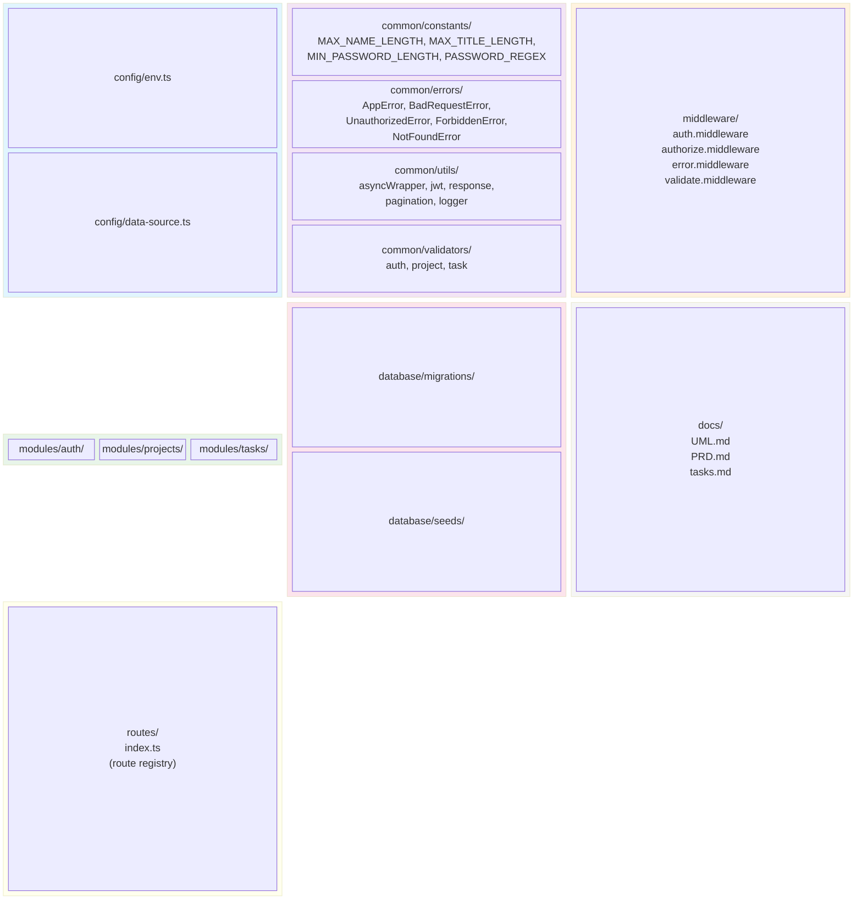
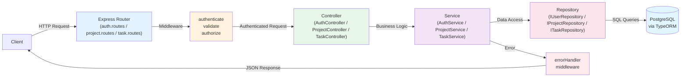

# Classes & Interfaces UML Diagram

> Architecture overview of the Project & Task Management API

---

## Complete Class Diagram

```mermaid
classDiagram
    direction TB

    %% ==========================================
    %% ENUMS
    %% ==========================================
    class UserRole {
        <<enumeration>>
        MEMBER = "member"
        ADMIN = "admin"
    }

    class ProjectStatus {
        <<enumeration>>
        ACTIVE = "active"
        COMPLETED = "completed"
        ARCHIVED = "archived"
    }

    class TaskStatus {
        <<enumeration>>
        PENDING = "pending"
        IN_PROGRESS = "in_progress"
        DONE = "done"
    }

    class TaskPriority {
        <<enumeration>>
        LOW = "low"
        MEDIUM = "medium"
        HIGH = "high"
    }

    %% ==========================================
    %% ERROR HIERARCHY
    %% ==========================================
    class AppError {
        <<abstract>>
        -statusCode: number
        -isOperational: boolean
        +constructor(message, statusCode, isOperational?)
    }

    class BadRequestError {
        +constructor(message?)
    }

    class UnauthorizedError {
        +constructor(message?)
    }

    class ForbiddenError {
        +constructor(message?)
    }

    class NotFoundError {
        +constructor(message?)
    }

    AppError <|-- BadRequestError : extends
    AppError <|-- UnauthorizedError : extends
    AppError <|-- ForbiddenError : extends
    AppError <|-- NotFoundError : extends

    %% ==========================================
    %% ENTITY CLASSES (TypeORM)
    %% ==========================================
    class User {
        <<Entity: users>>
        +id: string «UUID»
        +name: string
        +email: string «unique»
        +password: string «select:false»
        +role: UserRole
        +createdAt: Date
        +updatedAt: Date
    }

    class Project {
        <<Entity: projects>>
        +id: string «UUID»
        +title: string
        +description: string
        +status: ProjectStatus
        +ownerId: string «UUID»
        +createdAt: Date
        +updatedAt: Date
        +deletedAt: Date «soft delete»
    }

    class Task {
        <<Entity: tasks>>
        +id: string «UUID»
        +title: string
        +description: string
        +status: TaskStatus
        +priority: TaskPriority
        +dueDate: Date
        +projectId: string «UUID»
        +createdAt: Date
        +updatedAt: Date
    }

    User "1" --> "*" Project : owns
    Project "1" --> "*" Task : contains

    %% ==========================================
    %% REPOSITORY INTERFACES
    %% ==========================================
    class IUserRepository {
        <<interface>>
        +findOne(options): Promise~User~\null\
        +create(data): User
        +save(user): Promise~User\
        +createQueryBuilder(alias): QueryBuilder
    }

    class IProjectRepository {
        <<interface>>
        +findOne(options): Promise~Project~\null\
        +create(data): Project
        +save(project): Promise~Project\
        +softRemove(project): Promise~Project\
        +createQueryBuilder(alias): QueryBuilder
    }

    class ITaskRepository {
        <<interface>>
        +findOne(options): Promise~Task~\null\
        +create(data): Task
        +save(task): Promise~Task\
        +remove(task): Promise~Task\
        +createQueryBuilder(alias): QueryBuilder
    }

    User ..|> IUserRepository : implemented by TypeORM
    Project ..|> IProjectRepository : implemented by TypeORM
    Task ..|> ITaskRepository : implemented by TypeORM

    %% ==========================================
    %% SERVICE INTERFACES
    %% ==========================================
    class IAuthService {
        <<interface>>
        +register(input: RegisterInput): Promise~AuthResponse\
        +login(input: LoginInput): Promise~AuthResponse\
        +getProfile(userId): Promise~User\
    }

    class IProjectService {
        <<interface>>
        +create(input, ownerId): Promise~Project\
        +findAll(query, userId, isAdmin): Promise~PaginatedResult\
        +findById(id, userId, isAdmin): Promise~Project\
        +update(id, input, userId, isAdmin): Promise~Project\
        +delete(id, userId, isAdmin): Promise~void\
    }

    class ITaskService {
        <<interface>>
        +create(input, projectId, userId, isAdmin): Promise~Task\
        +findByProject(projectId, query, userId, isAdmin): Promise~PaginatedResult\
        +findById(id): Promise~Task\
        +findAll(query, userId, isAdmin): Promise~PaginatedResult\
        +update(id, input): Promise~Task\
        +delete(id): Promise~void\
    }

    %% ==========================================
    %% SERVICE CLASSES
    %% ==========================================
    class AuthService {
        -userRepository: IUserRepository
        +register(input): Promise~AuthResponse\
        +login(input): Promise~AuthResponse\
        +getProfile(userId): Promise~User\
        -generateToken(user): string
    }

    class ProjectService {
        -projectRepository: IProjectRepository
        +create(input, ownerId): Promise~Project\
        +findAll(query, userId, isAdmin): PaginatedResult\
        +findById(id, userId, isAdmin): Promise~Project\
        +update(id, input, userId, isAdmin): Promise~Project\
        +delete(id, userId, isAdmin): Promise~void\
    }

    class TaskService {
        -taskRepository: ITaskRepository
        -projectRepository: IProjectRepository
        +create(input, projectId, userId, isAdmin): Promise~Task\
        +findByProject(projectId, query, userId, isAdmin): PaginatedResult\
        +findById(id): Promise~Task\
        +findAll(query, userId, isAdmin): PaginatedResult\
        +update(id, input): Promise~Task\
        +delete(id): Promise~void\
    }

    AuthService ..|> IAuthService : implements
    ProjectService ..|> IProjectService : implements
    TaskService ..|> ITaskService : implements

    AuthService --> IUserRepository : injects via constructor
    AuthService --> JwtUtil : uses
    ProjectService --> IProjectRepository : injects via constructor
    TaskService --> ITaskRepository : injects via constructor
    TaskService --> IProjectRepository : injects via constructor

    %% ==========================================
    %% CONTROLLER CLASSES
    %% ==========================================
    class AuthController {
        -authService: IAuthService
        +register(req, res): Promise~void\
        +login(req, res): Promise~void\
        +getProfile(req, res): Promise~void\
    }

    class ProjectController {
        -projectService: IProjectService
        +create(req, res): Promise~void\
        +findAll(req, res): Promise~void\
        +findById(req, res): Promise~void\
        +update(req, res): Promise~void\
        +delete(req, res): Promise~void\
    }

    class TaskController {
        -taskService: ITaskService
        +create(req, res): Promise~void\
        +findByProject(req, res): Promise~void\
        +findById(req, res): Promise~void\
        +findAll(req, res): Promise~void\
        +update(req, res): Promise~void\
        +delete(req, res): Promise~void\
    }

    AuthController --> IAuthService : depends on
    ProjectController --> IProjectService : depends on
    TaskController --> ITaskService : depends on

    %% ==========================================
    %% UTILITY CLASSES
    %% ==========================================
    class JwtUtil {
        +generateToken(payload: JwtPayload): string
        +verifyToken(token: string): JwtPayload
    }

    class EnvConfig {
        <<singleton>>
        +PORT: number
        +DB_HOST: string
        +DB_PORT: number
        +DB_USER: string
        +DB_PASSWORD: string
        +DB_NAME: string
        +JWT_SECRET: string
        +JWT_EXPIRES_IN: string
        +NODE_ENV: string
        +CORS_ORIGINS: string
        +RATE_LIMIT_WINDOW_MS: number
        +RATE_LIMIT_MAX: number
        +BCRYPT_SALT_ROUNDS: number
        +API_PREFIX: string
        +DOCS_PATH: string
        +HEALTH_PATH: string
        +APP_HOST: string
        +APP_URL: string
        +LOGGER_ERROR_PATH: string
        +LOGGER_COMBINED_PATH: string
        +LOGGER_SERVICE_NAME: string
        +SEED_ADMIN_EMAIL: string
        +SEED_ADMIN_PASSWORD: string
        +SEED_USER_EMAIL: string
        +SEED_USER_PASSWORD: string
        +DEFAULT_PAGE_LIMIT: number
        +MAX_PAGE_LIMIT: number
    }

    class AppDataSource {
        <<TypeORM DataSource>>
        +initialize(): Promise~void\
        +getRepository(entity): Repository
    }

    AuthService --> EnvConfig : reads JWT config
    JwtUtil --> EnvConfig : reads JWT_SECRET, JWT_EXPIRES_IN
```

---

## Package Diagram

---

## Data Flow Diagram

---

## Legend

| Symbol | Meaning |
|--------|---------|
| `A <\|-- B` | B **extends** A (inheritance) |
| `A ..\|> B` | A **implements** B (interface) |
| `A --> B` | A **depends on** / uses B |
| `<<interface>>` | Interface definition |
| `<<abstract>>` | Abstract class |
| `<<enumeration>>` | Enum type |
| `<<Entity: name>>` | TypeORM entity |
| `+` | Public member |
| `-` | Private member |
| `«unique»` | Unique constraint |
| `«select:false»` | Not selected by default |

---

## SOLID Principles Reference

| Principle | Where Applied |
|-----------|---------------|
| **S** - Single Responsibility | JwtUtil (token only), Services (business logic only), Controllers (HTTP handling only) |
| **O** - Open/Closed | Error hierarchy (new errors extend AppError without modification) |
| **L** - Liskov Substitution | All error subclasses are interchangeable with AppError |
| **I** - Interface Segregation | Separate interfaces for each service and repository |
| **D** - Dependency Inversion | Controllers → interfaces, Services → repository interfaces (constructor injection) |
